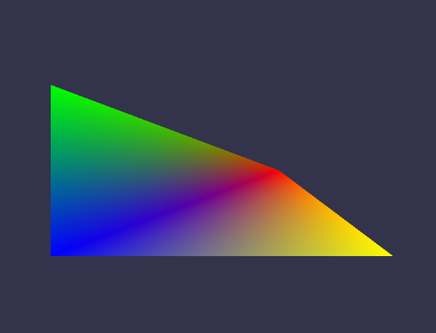
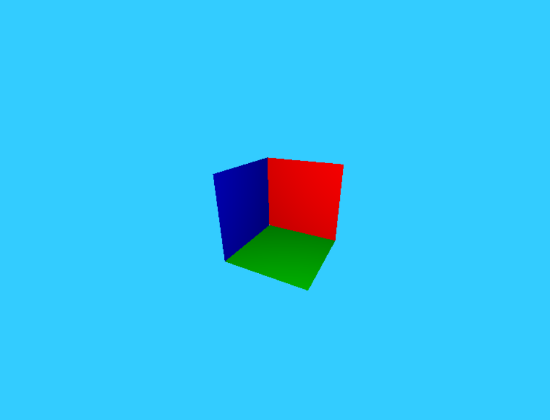
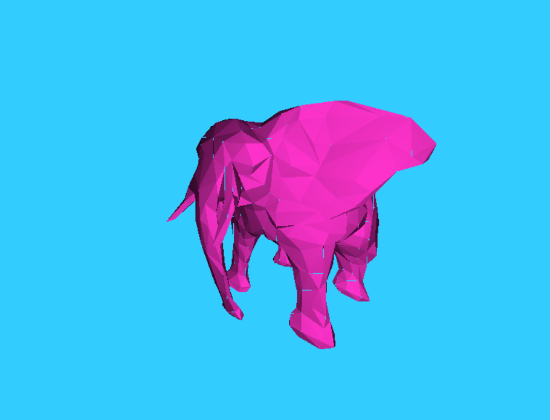

# Rasterizer

A simple rasterization renderer written in Go, based on the tutorial ["Rasterization: a Practical Implementation"](https://www.scratchapixel.com/lessons/3d-basic-rendering/rasterization-practical-implementation/overview-rasterization-algorithm).

## Some output images

